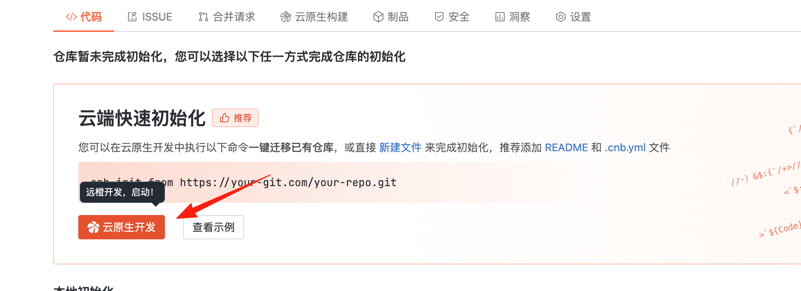

# Using with Docker

## Notes
1. Example parameter values are `xxx`, replace with your actual values. [Detailed parameters](parameters.md)  

2. **[Cloud Native Development](https://docs.cnb.cool/zh/workspaces/intro.html) environment has docker cli integrated by default and runs faster on internal network**

3. For Windows Powershell environment, replace line continuation ` \ ` with backtick `, and $(pwd) with ${PWD}

## Usage
1. Create an empty repository in CNB

2. Click `Cloud Native Development`


3. Open with `WebIDE`

4. Copy the migration command below to terminal based on your situation, replace `xxx`, then execute


5. Wait for migration to complete and verify final results

## Examples
* <details>
    <summary> Migrate from CODING </summary>

    Result: Original CODING projects will create same-name sub-orgs in CNB, with repositories migrated under them
    
    ### Migrate all team repositories
    ```shell
    docker run --rm  \
      -e PLUGIN_SOURCE_TOKEN="xxx"  \
      -e PLUGIN_CNB_ROOT_ORGANIZATION="xxx" \
      -e PLUGIN_CNB_TOKEN="xxx"  \
      -v $(pwd):$(pwd) -w $(pwd) \
      cnbcool/code-import
    ```
    
    ### Migrate specific projects
    Replace PLUGIN_SOURCE_PROJECT as needed, see [Parameters](parameters.md)
    ```shell
    docker run --rm  \
      -e PLUGIN_SOURCE_TOKEN="xxx"  \
      -e PLUGIN_SOURCE_PROJECT="project1,project2" \
      -e PLUGIN_CNB_ROOT_ORGANIZATION="xxx" \
      -e PLUGIN_CNB_TOKEN="xxx"  \
      -e PLUGIN_MIGRATE_TYPE="project" \
      -v $(pwd):$(pwd) -w $(pwd) \
      cnbcool/code-import
    ```
    
    ### Migrate specific repositories
    Replace PLUGIN_SOURCE_REPO as needed, see [Parameters](parameters.md)
    ```shell
    docker run --rm  \
      -e PLUGIN_SOURCE_TOKEN="xxx"  \
      -e PLUGIN_SOURCE_REPO="<TEAM-NAME>/<PROJECT-NAME>/<REPO-NAME>,test-team/project1/repoA,test-team/project2/repoB" \
      -e PLUGIN_CNB_ROOT_ORGANIZATION="xxx" \
      -e PLUGIN_CNB_TOKEN="xxx"  \
      -e PLUGIN_MIGRATE_TYPE="repo" \
      -v $(pwd):$(pwd) -w $(pwd) \
      cnbcool/code-import
    ```
  </details>

* <details>
    <summary> Migrate from GitHub </summary>

    Result: All organizations accessible to GitHub account will create same-name sub-orgs in CNB with repositories migrated under them
    ```shell
    docker run --rm  \
      -e PLUGIN_SOURCE_TOKEN="xxx"  \
      -e PLUGIN_SOURCE_URL="https://github.com" \
      -e PLUGIN_SOURCE_PLATFORM="github" \
      -e PLUGIN_CNB_ROOT_ORGANIZATION="xxx" \
      -e PLUGIN_CNB_TOKEN="xxx"  \
      -v $(pwd):$(pwd) -w $(pwd) \
      cnbcool/code-import
    ```
  </details>

* <details>
    <summary> Migrate from GitLab </summary>
  
    Result: All groups accessible to GitLab account will create same-name sub-orgs in CNB (multi-level group structures will be preserved)
    ```shell
    docker run --rm  \
      -e PLUGIN_SOURCE_TOKEN="xxx"  \
      -e PLUGIN_SOURCE_URL="https://gitlab.com" \
      -e PLUGIN_SOURCE_PLATFORM="gitlab" \
      -e PLUGIN_CNB_ROOT_ORGANIZATION="xxx" \
      -e PLUGIN_CNB_TOKEN="xxx"  \
      -v $(pwd):$(pwd) -w $(pwd) \
      cnbcool/code-import
    ```
  </details>

* <details>
    <summary> Migrate from Gitee </summary>

    Result: All organizations accessible to Gitee account will create same-name sub-orgs in CNB (multi-level structures preserved)
    ```shell
    docker run --rm  \
      -e PLUGIN_SOURCE_TOKEN="xxx"  \
      -e PLUGIN_SOURCE_URL="https://gitee.com" \
      -e PLUGIN_SOURCE_PLATFORM="gitee" \
      -e PLUGIN_CNB_ROOT_ORGANIZATION="xxx" \
      -e PLUGIN_CNB_TOKEN="xxx"  \
      -v $(pwd):$(pwd) -w $(pwd) \
      cnbcool/code-import
    ```
  </details>

* <details>
    <summary> Migrate from Codeup (Alibaba Cloud) </summary>

    Result: All organizations accessible to Codeup account will create same-name sub-orgs in CNB (multi-level structures preserved)
    ```shell
    docker run --rm  \
      -e PLUGIN_SOURCE_TOKEN="xxx"  \
      -e PLUGIN_SOURCE_PLATFORM="aliyun" \
      -e PLUGIN_SOURCE_ORGANIZATIONID="xxx" \
      -e PLUGIN_CNB_ROOT_ORGANIZATION="xxx" \
      -e PLUGIN_CNB_TOKEN="xxx"  \
      -v $(pwd):$(pwd) -w $(pwd) \
      cnbcool/code-import
    ```
  </details>

* <details>
    <summary> Migrate from common third-party platforms </summary>

    For common platforms, group field in PLUGIN_SOURCE_REPO will map to sub-orgs in CNB
    ### HTTP protocol
    ```shell
    docker run --rm  \
      -e PLUGIN_SOURCE_USERNAME="xxx"  \
      -e PLUGIN_SOURCE_PASSWORD="xxx"  \
      -e PLUGIN_SOURCE_REPO="group1/repo1,group1/repo2,group2/repo3" \
      -e PLUGIN_SOURCE_URL="https://common.example.com" \
      -e PLUGIN_SOURCE_PLATFORM="common" \
      -e PLUGIN_CNB_ROOT_ORGANIZATION="xxx" \
      -e PLUGIN_CNB_TOKEN="xxx"  \
      -v $(pwd):$(pwd) -w $(pwd) \
      cnbcool/code-import
    ```
    
    ### SSH protocol
    ⚠️For SSH protocol, ensure private key file exists in working directory named `ssh.key`
    ```shell
    docker run --rm  \
      -e PLUGIN_SOURCE_REPO="group1/repo1,group1/repo2,group2/repo3" \
      -e PLUGIN_SOURCE_URL="https://common.example.com" \
      -e PLUGIN_SOURCE_PLATFORM="common" \
      -e PLUGIN_CNB_ROOT_ORGANIZATION="xxx" \
      -e PLUGIN_CNB_TOKEN="xxx"  \
      -e GIT_SSH_COMMAND='ssh -o StrictHostKeyChecking=no -o UserKnownHostsFile=/dev/null' \  
      -v $(pwd):$(pwd) -w $(pwd) \
      cnbcool/code-import
    ```
  </details>

* <details>
    <summary> Migrate from Tencent Git </summary>
  ```shell
    docker run --rm  \
    -e PLUGIN_SOURCE_TOKEN="xxx"  \
    -e PLUGIN_SOURCE_URL="https://git.woa.com" \
    -e PLUGIN_SOURCE_PLATFORM="gongfeng" \
    -e PLUGIN_CNB_ROOT_ORGANIZATION="xxx" \
    -e PLUGIN_CNB_TOKEN="xxx"  \
    -v $(pwd):$(pwd) -w $(pwd) \
    cnbcool/code-import
  ```
  </details>

* <details>
    <summary> Migrate from CNB </summary>

    Migrate all repositories under specified root organization
    ```shell
    docker run --rm  \
      -e PLUGIN_SOURCE_GROUP="xxx" \
      -e PLUGIN_SOURCE_TOKEN="xxx"  \
      -e PLUGIN_SOURCE_URL="https://cnb.example1.com" \
      -e PLUGIN_SOURCE_PLATFORM="cnb" \
      -e PLUGIN_CNB_ROOT_ORGANIZATION="xxx" \
      -e PLUGIN_CNB_TOKEN="xxx"  \
      -e PLUGIN_CNB_URL="https://cnb.example2.com" \
      -v $(pwd):$(pwd) -w $(pwd) \
      cnbcool/code-import
    ```
  </details>

* <details>
    <summary> Select specific repositories to migrate </summary>
    
    First run generates repository list file `repo-path.txt`
    
    Example for CODING (add `-e PLUGIN_MIGRATE_ALLOW_SELECT_REPOS="true" \` parameter for other platforms):
    
    ```shell
    docker run --rm  \
      -e PLUGIN_SOURCE_TOKEN="xxx"  \
      -e PLUGIN_CNB_ROOT_ORGANIZATION="xxx" \
      -e PLUGIN_CNB_TOKEN="xxx"  \
      -e PLUGIN_MIGRATE_ALLOW_SELECT_REPOS="true" \
      -v $(pwd):$(pwd) -w $(pwd) \
      cnbcool/code-import
    ```
    
    **After first run, tool generates `repo-path.txt`. Edit this file to keep only repositories you want to migrate.**
    
    After editing, run same command again to migrate only selected repositories:
    
    ```shell
    docker run --rm  \
      -e PLUGIN_SOURCE_TOKEN="xxx"  \
      -e PLUGIN_CNB_ROOT_ORGANIZATION="xxx" \
      -e PLUGIN_CNB_TOKEN="xxx"  \
      -e PLUGIN_MIGRATE_ALLOW_SELECT_REPOS="true" \
      -v $(pwd):$(pwd) -w $(pwd) \
      cnbcool/code-import
    ```

    **To re-select repositories, delete `repo-path.txt` and run command again.**
  </details>

## Incremental updates from source platform
Clear successful.log in working directory

Effect: Re-sync all repositories from source platform. For repositories already migrated to CNB, any updates will be incrementally synced to CNB.