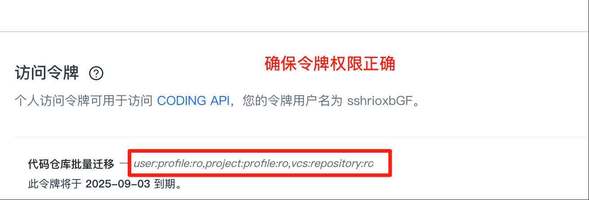

## 1. Create source platform token
Using CODING as example ([create here](https://e.coding.net/user/account/setting/tokens)), for other `source platforms` see `PLUGIN_SOURCE_TOKEN` in [Parameters](./parameters.md)

⚠️ Only `team owner` or `team admin` token

⚠️ Permission requirements: `User info-read only`, `Project info-read only`, `Repository-read only`

## 2. Create root organization in CNB

Scan QR to login CNB, click `+ icon at top right` to create organization

⚠️ Tip: Can only create one per year

## 3. Create CNB access token
Permission requirements: For common scenarios select `Migration Tool Credentials` for quick authorization.  
Create at: https://cnb.cool/profile/token

