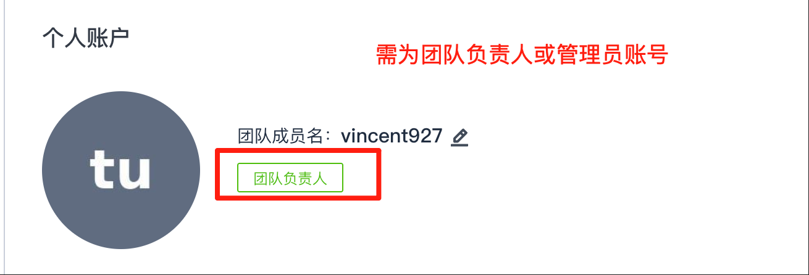

1. 创建源平台 token  
以 CODING 为例，其他源平台详见[参数介绍](./parameters.md)中的`PLUGIN_SOURCE_TOKEN`    
⚠️**仅限团队负责人或团队管理员token**  
⚠️**权限要求:用户信息-只读、项目信息-只读、代码仓库-只读**   
创建地址:https://e.coding.net/user/account/setting/tokens

2. CNB 创建根组织  
扫码登录 CNB，点击右上角+号创建组织（tips:一年只能创建一个）
3. 创建 CNB 访问令牌  
权限要求: 常见场景勾选`迁移工具凭据`，即可快速完成授权。  
创建地址:https://cnb.cool/profile/token
