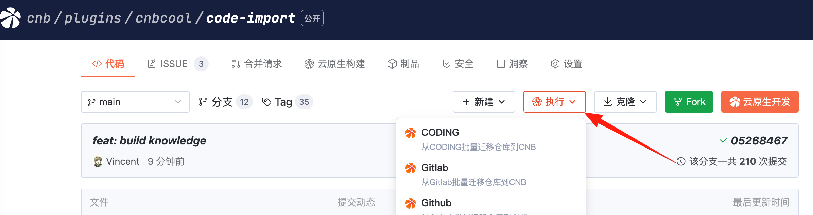
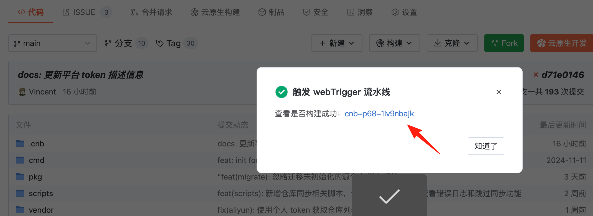
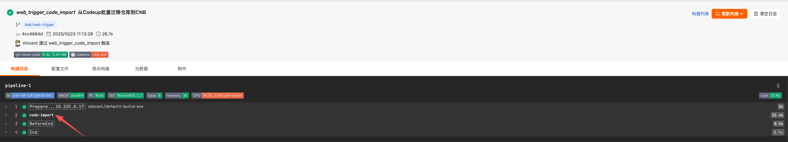

## 使用步骤
⚠️ 注意: 该方式会在仓库启动一个流水线执行迁移任务，由于 Fork 的仓库是公开的，故迁移日志可公开访问，日志中包含`仓库路径`等敏感信息，可在迁移完成后点击流水线右上方`清空日志`或者`删除 Fork 的仓库`，也可以创建 1个空的私有仓库然后使用[cnb-init-from](https://docs.cnb.cool/zh/guide/first-repo.html#3-1-yun-duan-kuai-su-chu-shi-hua-tui-jian)导入本仓库，或选用[云原生开发](docker-usage.md)方法迁移。

1. Fork 本仓库到你的组织下任意位置

2. 点击仓库上方`CODING 迁移至 CNB`按钮，如果是其他平台，点击按钮旁边`...`，选择对应`源平台`，根据提示填写相应配置参数，有提供默认参数的一般可以直接使用默认参数，不需要修改。

    从 CODING 迁移至 CNB，只需填写 源平台 Token、CNB平台 Token、CNB 根组织名称（注意一定是你创建的，且CNB Token 有权限），如未提前准备，请参考[迁移前准备](./ready.md)

3. 点击`左下方 橙色 按钮`，启动自定义事件，开始运行迁移任务

4. 点击弹窗中的超链接，查看任务运行日志

5. 耐心等待迁移任务执行完成，点击 code-import 这一步，查看日志最终输出结果，检查 `迁移失败` 和 `忽略迁移` 数量是否为 0，并在 CNB 侧确认仓库是否全部完成迁移

