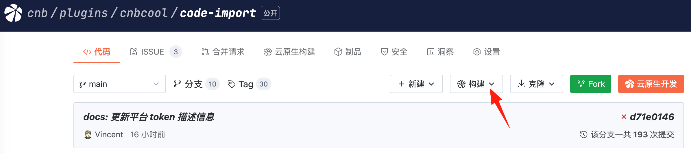
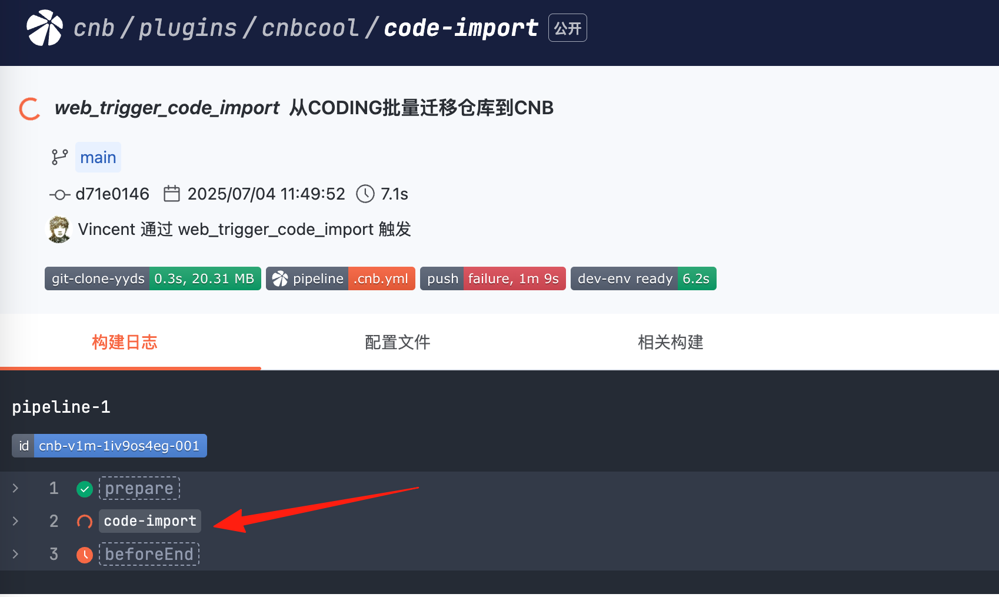
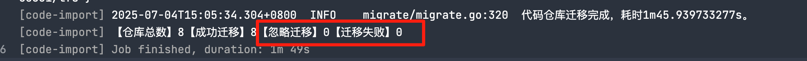

### 注意⚠️
该方式会在仓库启动一个流水线执行迁移任务，迁移日志会公开，日志中包含仓库名。

### 使用方法
1. Fork 本仓库到你的组织下任意位置

2. 点击仓库上方执行按钮，选择对应源平台，根据提示填写相应配置参数。

3. 点击左下方橙色按钮，启动自定义事件，开始运行迁移任务
4. 点击弹窗中的超链接，查看任务运行日志

5. 点击 code-import 这一步，查看日志输出

6. 等待迁移任务执行完成，查看日志最终输出结果，**检查迁移失败和忽略迁移数量是否为0**，确认仓库是否全部完成迁移 
